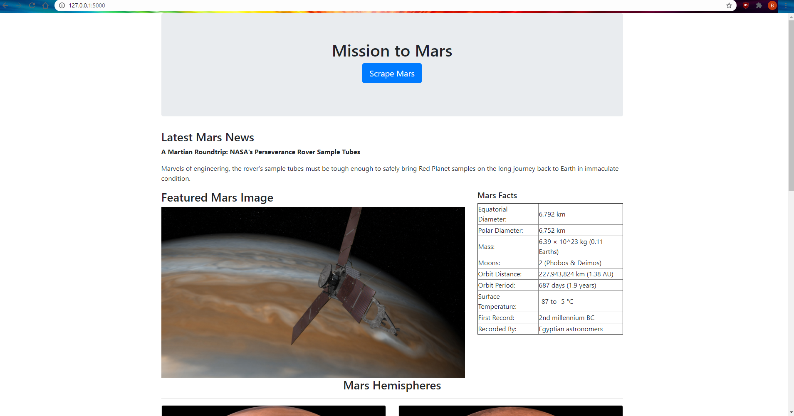
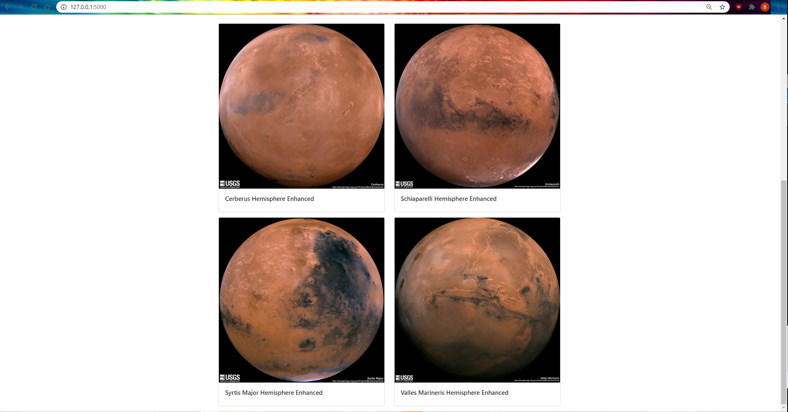

# Scrape Mars

app.py is a flask app that calls the scrape function in scrape_mars.py, which scrapes different websites for information and pictures of mars/space and then displays the scraped information on a webpage.

### Screenshots

